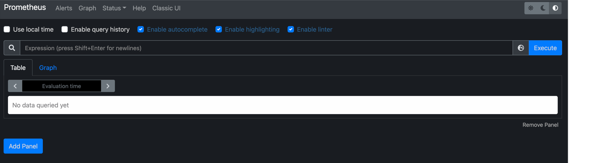
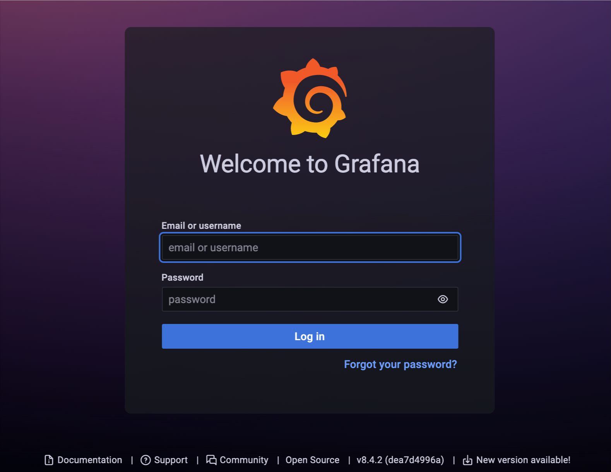
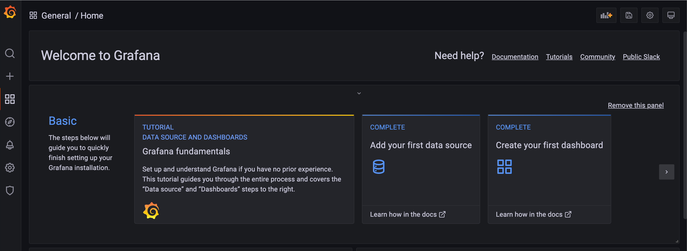
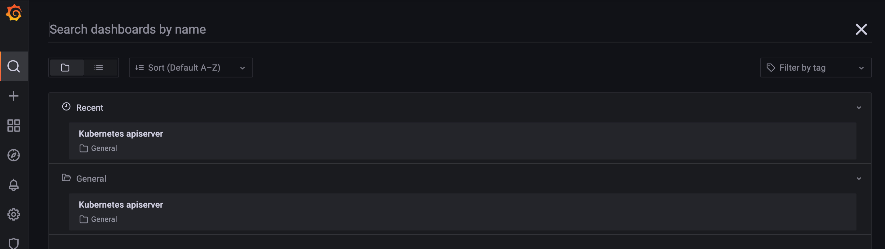
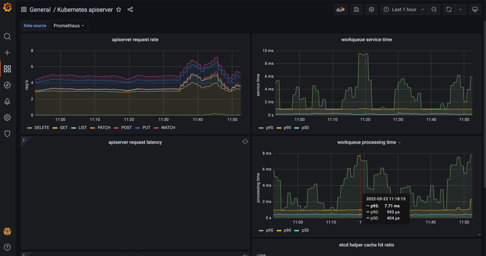

# [](https://github.com/guivin/terraform-helm-example/actions/workflows/main.yml)

This repository shows how to use Helm with Terraform using the official [Helm provider](https://registry.terraform.io/providers/hashicorp/helm/2.4.1). 

This deploys a monitoring infrastructure with [Grafana](https://grafana.com/) & [Prometheus](https://prometheus.io/) 
as a concrete example.

## Requirements

* `Helm >= 3.0`
* `Terraform >= 1.0.0`

## Deployment

Clone the project:

```bash
$ git clone https://github.com/guivin/terraform-helm-example.git
```

Initialize the Terraform project:

```bash
$ terraform init
```

Deploy the Terraform project:

```
$ terraform apply
```

## Pass values to Helm charts in Terraform

There are several ways to pass values to the `helm_release` resource. In this section, we will the different options.


### Using a values.yaml file

The `values.yaml` of the Helm can be templated by Terraform and specified in the values field:

```hcl
resource "helm_release" "prometheus" {
  chart      = "prometheus"
  name       = "prometheus"
  namespace  = var.namespace
  repository = "https://prometheus-community.github.io/helm-charts"
  version    = "15.5.3"

  values = [
    templatefile("${path.module}/templates/prometheus-values.yaml", {
      pod_security_enabled             = true
      server_persistent_volume_enabled = false
      server_resources_limits_cpu      = "256m"
      server_resources_limits_memory   = "256Mi"
      server_resources_requests_cpu    = "256m"
      server_resources_requests_memory = "256Mi"
    })
  ]
}
```

### Using the set blocks

The Helm chart values can be customized with `set` blocks:

```hcl
resource "helm_release" "prometheus" {
  chart      = "prometheus"
  name       = "prometheus"
  namespace  = var.namespace
  repository = "https://prometheus-community.github.io/helm-charts"
  version    = "15.5.3"

  set {
    name  = "podSecurityPolicy.enabled"
    value = true
  }

  set {
    name  = "server.persistentVolume.enabled"
    value = false
  }

  # You can provide a map of value using yamlencode. Don't forget to escape the last element after point in the name
  set {
    name  = "server\\.resources"
    value = yamlencode({
      limits   = {
        cpu    = "256m"
        memory = "256Mi"
      }
      requests = {
        cpu    = "256m"
        memory = "256Mi"
      }
    })
  }
}
```

### Using the values and yamlencode

The values of the Helm charts can be added directly as map in the `values` field and encoded into YAML:
```hcl
resource "helm_release" "prometheus" {
  chart      = "prometheus"
  name       = "prometheus"
  namespace  = var.namespace
  repository = "https://prometheus-community.github.io/helm-charts"
  version    = "15.5.3"

  values = [
    yamlencode({
      podSecurityPolicy = {
        enabled = true
      }
      server            = {
        persistentVolume = {
          enabled = false
        }
        resources        = {
          limits   = {
            cpu    = "256m"
            memory = "256Mi"
          }
          requests = {
            cpu    = "256m"
            memory = "256Mi"
          }
        }
      }
    })
  ]
}
```

## Access Prometheus UI

Create the port-forward session to the Prometheus server:
```bash
$ kubectl port-forward --namespace monitoring svc/prometheus-server 8080:80
```

Go to [http://localhost:8080](http://localhost:8080) to access the Prometheus UI:



## Access Grafana UI

Create the port-forward session to Grafana:

```bash
kubectl port-forward --namespace monitoring svc/grafana 3000:80
```

Get the Grafana admin username:

```bash
$ kubectl get secret --namespace monitoring grafana -o jsonpath="{.data.admin-user}" | base64 --decode 
```

Get the Grafana admin password:

```bash
kubectl get secret --namespace monitoring grafana -o jsonpath="{.data.admin-password}" | base64 --decode
```

Go to [http://localhost:3000](http://localhost:3000) to access the Grafana UI. Reuse the previous credentials to log in:








The [Kubernetes API Server dashboard](https://grafana.com/grafana/dashboards/12006) is provisioned in the `values-grafana.yaml` file. 

The dashboard is visible in the Grafana UI:
